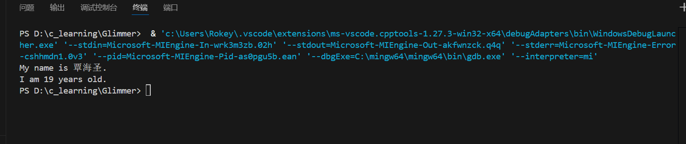

# 微光招新EZ01(step1)

[Markdown学习参考](https://blog.csdn.net/Aqua_chang/article/details/147000144)

## 1.`#include <stdio.h>` 的含义与作用
**含义：**  
`#include <stdio.h>` 是一个头文件，用来在编译之前将需要使用的函数文件包含进来。

**作用：**  
* 提供了函数的声明。
* 使程序能够使用标准库中的函数进行数据的读取和输出。

***

## 2. `main` 函数的作用及定义为 `int` 类型的原因

**作用：**  
`main` 函数是 C 程序的**起点**。程序从 `main` 函数开始执行，并在 `main` 函数结束时终止。

**为什么返回 `int` 类型：**  
* `main` 函数返回一个整数值给操作系统，表示程序的退出状态，通常返回0表示程序正常进行，非0则表示程序未正常进行。
* C++标准规定了`main`函数必须返回`int`类型，而其他类型如`void`并非被所有编译器所支持。

***

## 3. `int` 类型存储方式基本数据类型

**`int` 类型：**  
`int` 用于存储**整数**的数据类型。

**C语言中的基本数据类型：**  
| 类型         说明                     |
|-------------|--------------------------|
| `int`       | 整数                     |
| `float`     | 单精度浮点数             |
| `double`    | 双精度浮点数             |
| `char`      | 字符                     |

***

## 4. 转义字符 `\n` 的含义及回车键的本质

**`\n` 的含义：**  
`\n` 是**换行符**，是下一次输出在下一行的开头。

**回车键的本质：**  
回车键实际上输入的是**换行符**（`\n`），用于表示一行的结束并开始新的一行。

***

## 5.完成截图
