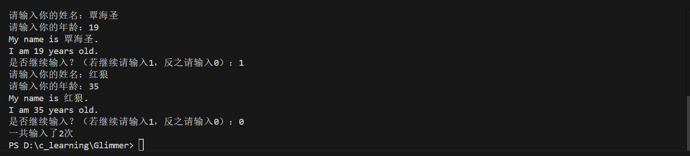

# 微光招新EZ01(step2)

## 1. 变量类型

**什么是变量的类型？为什么重要？**
- **变量类型**定义了变量能存储的数据种类。
- **重要性**：
  - 决定了变量能存储的数据范围。
  - 规定了能对该变量执行的操作。

**存储年龄的选择？**：
- 应选择 `int`（整数）类型，因为年龄是整数值。

**存储单词 "apple"**：
- 不能使用单个 `char` 类型变量，因为 `char` 只能存储单个字符。
- 应该使用字符数组，比如`char a[] = "apple" `。

***

## 2. 数组的起始与边界

**数组的第一个元素下标起点是？**
- 第一个元素下表从**0**开始。

**数组越界会导致什么问题？**
- 影响了数组中数据的输入或者输出，导致输入或者输出错误。
- 可能导致程序崩溃。
  
**数组越界为什么是一个常见又危险的错误？**
- 诱因常见，包括索引计算错误，边界情况错误等。
- 可能导致程序崩溃，甚至可能出现安全漏洞。
- 数组越界会使得同一代码在不同编译器中的结果不同，甚至可能会直接修改变量，导致出现逻辑错误。

***
  
## 3. 流程控制 - 循环结构

- 循环结构通过**条件判断**来控制代码块循环进行。

**`for`循环与`while`循环的基本结构？**
- `for`循环基本结构
- for(初始化; 条件判断; 迭代) 
- {
    // 循环内容
  }
- 初始化：设置循环变量的起始值。
- 条件判断：每次循环前进行条件判断，若满足条件则进行循环，否则跳出循环。
- 迭代：更新循环变量以进行下一次循环。
- `while`循环基本结构
- while(条件判断)
- {
-   // 循环内容
- }
  
**`while` 与 `do...while` 的首次执行条件判断区别？**
- `while` ： 先判断条件，满足条件才进行第一次循环。
- `do...while` ： 先进行第一次循环，再判断条件。
  
***

## 4. 流程控制 - 逻辑表达式

**逻辑表达式与算术表达式的本质区别？**
| 特性       逻辑表达式   算术表达式
|----------|-----------|-----------|
|运算对象   |布尔值(1/0)|数值
|运算结果   |布尔值(1/0)|数值

**部分逻辑运算符的含义**
| 运算符     含义      说明
|----------|---------|---------------------|
| `&&`     | 与逻辑  | 二者都为真时输出真
| `||`     | 或逻辑  | 二者有一者为真时输出真
| `!`      | 非逻辑  | 取反操作

## 5.小明的程序问题
- 按照发现顺序排序
1.第17行末尾为中文分号；，会导致无法进行编译，应该修改为英文分号;
2.if的条件判断语句中使用了赋值的`=`，导致flag恒为1无法跳出循环，应该改为比较运算符号`==`
3.count在每一次循环中都被赋值为0，导致输出的计数恒为0，应该将count移到循环外面进行初始化
4.最后的count应该包含第一次的输出，故最后应该输出count+1
5.题意为多次读取输入并多次输出，并非读取一次输入并多次输出，应该将输入内容放进`while`循环当中
6.~~我名字超过20个字符你不就炸了（嘻嘻）~~
7.**应该没有了吧）**
8.`true`在<stdio.h>中未被定义，经查阅应当使用<stdbool.h>

## 6.完成截图

